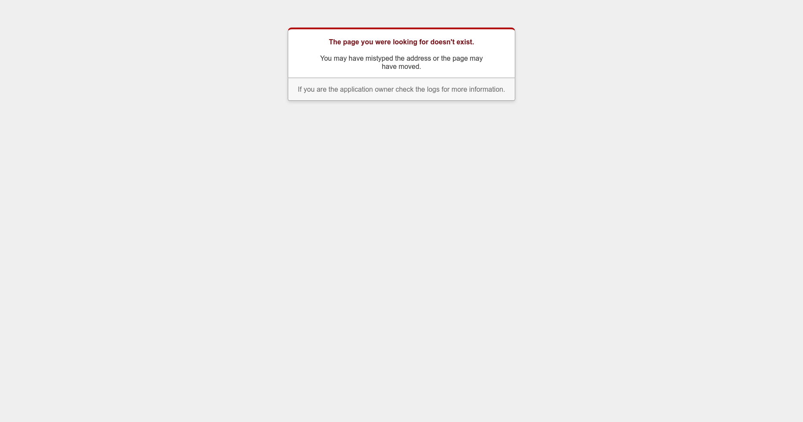
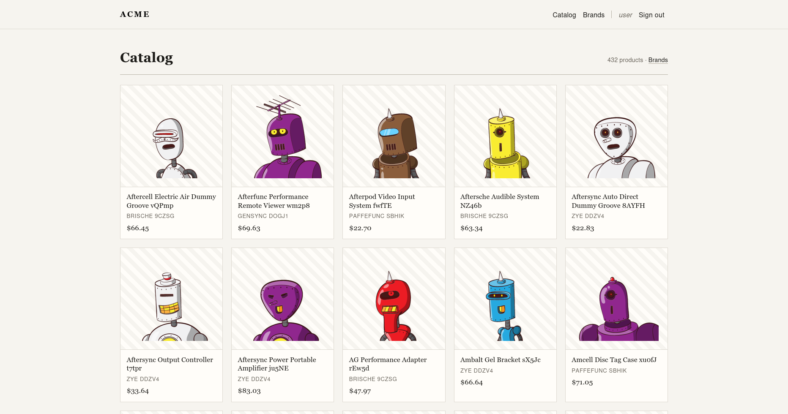
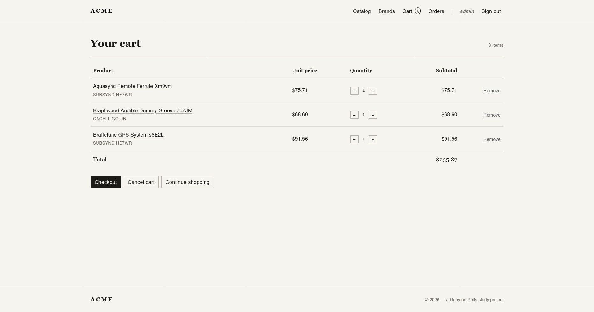
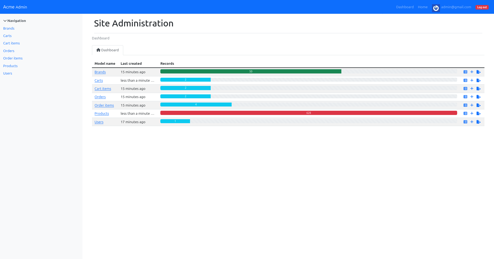
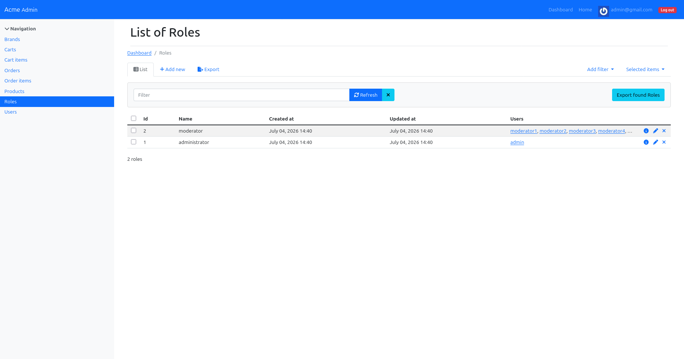
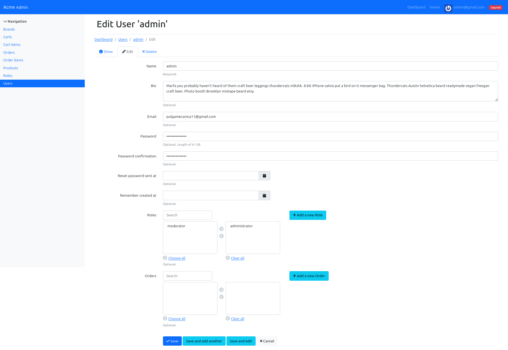

<h1 align="center">Ruby on Rails — 3 — Advanced</h1>

  Building <strong>acme</strong>, a small e-shopping website, in seven progressive versions. 
  Each exercise is an independent Rails app, deployed to its own subdomain on the same server.

  <em>Ruby 3.0.2 · Rails 7.0 · PostgreSQL · Devise · CarrierWave + Cloudinary · RailsAdmin · CanCanCan + Rolify · Docker · Kamal</em>

---

## Exercises

| # | Exercise | Adds | Live |
|---|----------|------|------|
| **[ex00](./ex00)** | MySQL is a bad habit | PostgreSQL-backed app, containerized & deployable | [ror-advanced-00](https://ror-advanced-00.pulgamecanica.com) |
| **[ex01](./ex01)** | You Sir? | Authentication with Devise (`User`) | [ror-advanced-01](https://ror-advanced-01.pulgamecanica.com) |
| **[ex02](./ex02)** | Get me something to sell | `Brand` & `Product`, images on Cloudinary | [ror-advanced-02](https://ror-advanced-02.pulgamecanica.com) |
| **[ex03](./ex03)** | Cart | Session cart, quantities, checkout & orders | [ror-advanced-03](https://ror-advanced-03.pulgamecanica.com) |
| **[ex04](./ex04)** | One panel to rule them all | Admin dashboard with RailsAdmin | [ror-advanced-04](https://ror-advanced-04.pulgamecanica.com) |
| **[ex05](./ex05)** | One account to rule them all | Roles (admin / moderator) via Rolify + CanCanCan | [ror-advanced-05](https://ror-advanced-05.pulgamecanica.com) |
| **[ex06](./ex06)** | Show me what you got | Online + seed: 2500 products, 50 brands, 20 users | [ror-advanced-06](https://ror-advanced-06.pulgamecanica.com) |

> Local dev: `cd exNN && docker compose up` · Deploy: `make setup-exNN` (see [`Makefile`](./Makefile)).

---

## ex00 — MySQL is a bad habit

<em>A PostgreSQL-backed “acme” app, containerized and ready to ship.</em>

## ex01 — You Sir?

<em>Sign up, sign in, edit your profile — authentication done right with Devise.</em>

## ex02 — Get me something to sell

<em>A catalog of brands and products, with images served from the Cloudinary CDN.</em>

## ex03 — Cart

<em>Add to cart, adjust quantities, and check out — a session-based basket.</em>

## ex04 — One panel to rule them all

<em>A full administration dashboard, generated by RailsAdmin.</em>

## ex05 — One account to rule them all

<em>Administrators and moderators, each with exactly the powers they should have.</em>

## ex06 — Show me what you got

<em>Live on the web, seeded with 2500 products across 50 brands.</em>

